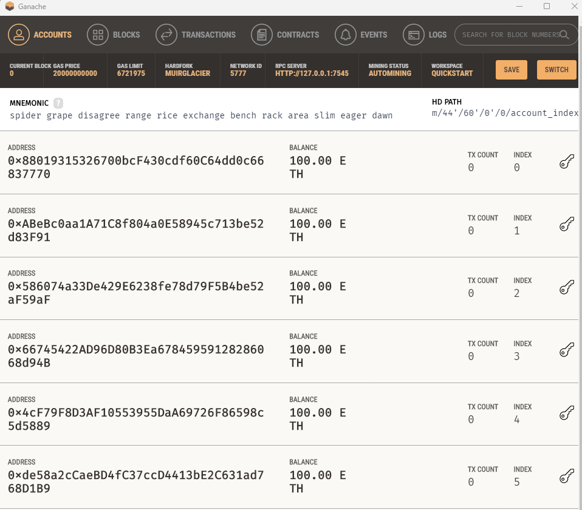

# Fintech Finder

## Purpose
This app is designed to simulate a web-based payment system using ETHER from the Ethereum blockchain. Accounts are paid from a test Ganache account.

---
## Files and Functions
The wallet and payment functions are stored in this file
        
        - cryto_wallet.py

The streamlit functions are stored in this file
    
        - fintech_finder.py
## Technologies
### Python:

    Phyton Version: **3.7.13**

### Streamlit
[streamlit](https://streamlit.io/)

### Web 3
[web3](https://ethereum.org/en/web3/)

## How to Use and DEMO

1. Download the libraries and dependencies for the web based interface: [streamlit](https://streamlit.io/)

        pip install streamlit

    

2. Download 
[Ganache](https://trufflesuite.com/ganache/)
    

3. Open the Ganache account 
    

4. Run the fintech_finder.py application with Streamlit

    - streamlit run fintech-finder.py

5. FinTech Finder (web app)

6. Payment function: Note the HASH generated after executing payment

7. Transaction record: NOTE TX HASH 

7. Balance Deducted: NOTE BALANCE DEDUCTED FROM ORIGINAL 100 ETHER. 

---
## Contributors
- Starter code and directions provided by UW Fintech program. 
---
## License
Tool is available under an MIT License.

---
## Aknowledgements
* [Markdown Guide](https://www.markdownguide.org/basic-syntax/#reference-style-links)
